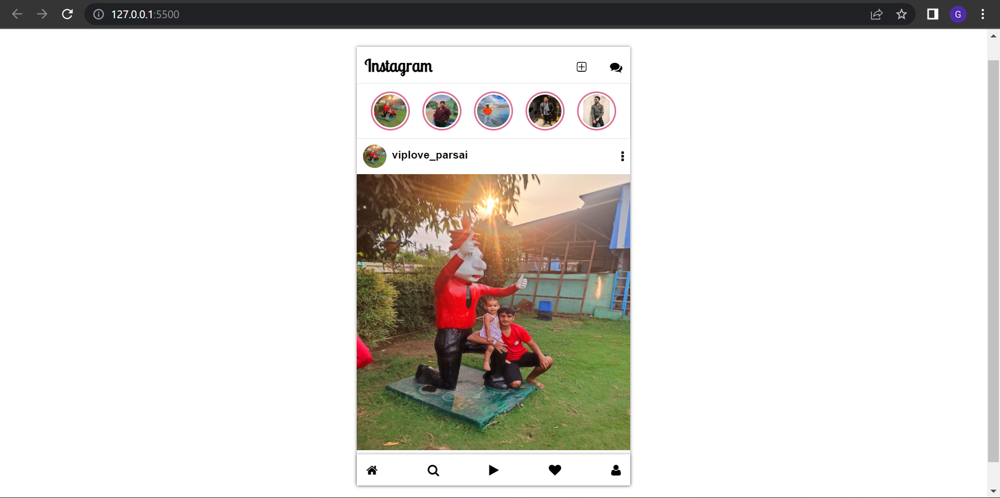

# Instagram UI Clone

This project is a clone of the Instagram web application interface, built using HTML, CSS, and Font Awesome icons.

## Features

- **Header Section**: Displays the Instagram logo and icons for adding new posts and accessing direct messages.
- **Stories Section**: Displays user stories in a horizontal scrollable layout.
- **Feed Section**: Displays user posts with like, comment, share, and bookmark options. It also shows the number of likes and comments for each post.
- **You're All Caught Up**: Indicates when the user has viewed all the recent posts.
- **Footer Section**: Provides navigation icons for the home feed, search, reels, activity notifications, and user profile.

## Technologies Used

- HTML: Structure of the web page.
- CSS: Styling and layout of the elements.
- Font Awesome: Icons used for various actions and navigation.

## Screenshots

## How to Use

1. Open the `index.html` file in a web browser.
2. Explore different sections of the Instagram clone interface.
3. Interact with the icons and posts to simulate the Instagram experience.

## Credits

- **Developer**: Viplove Parsai